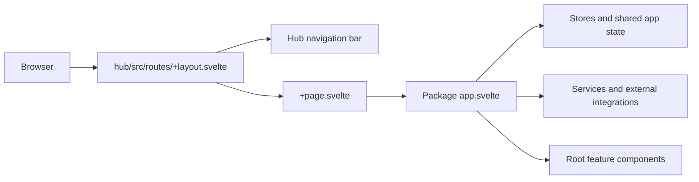
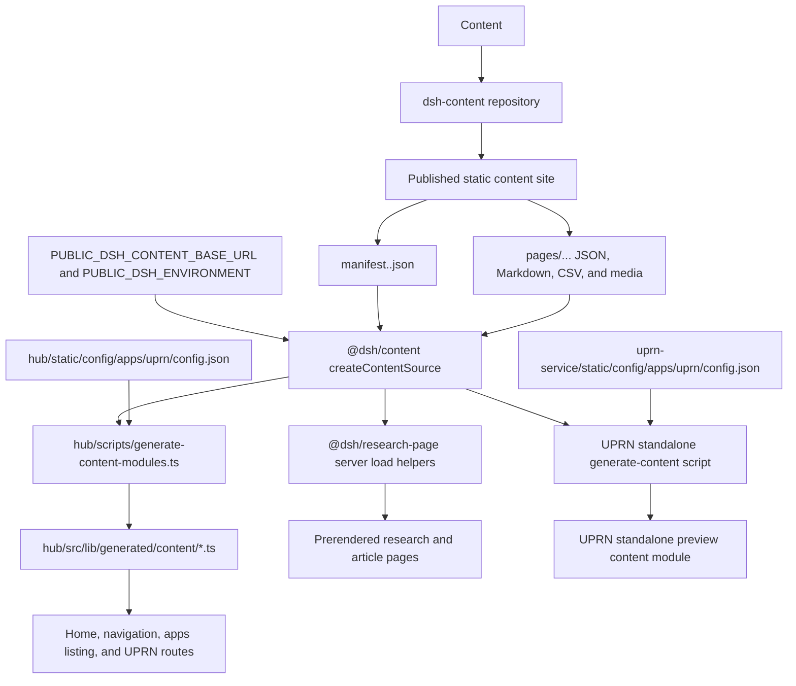

# Digital Solutions Hub Frontend Architecture

This document is the starting point to understand the architecture repository. It explains how the hub integrates the packages, where entry points live, content retreival, package configuration, and builds.

## Architecture Overview

The repository is a pnpm monorepo containing one primary application and several packages:

```text
root/
├── hub/                         Main SvelteKit site
├── packages/
│   ├── ai-catalogue/            Page feature package
│   ├── ai-where-to-build/       Page feature package
│   ├── maps-page/               Page feature package
│   ├── research-page/           Research pages, loaders, and rendering
│   ├── uprn-service/            Page feature package
│   ├── common/                  Shared utilities and ArcGIS/Markdown helpers
│   └── content/                 Shared dsh-content manifest client and generators
├── package.json                 Workspace-level scripts
└── pnpm-workspace.yaml          Workspace dependencies
```

The normal integrated rendering flow is:



The hub owns URLs and the site shell. Packages own feature behaviour and UI.

## The Hub

### Layout

The hub's root layout is `hub/src/routes/+layout.svelte`. It:

- Imports the hub's global styles.
- Renders the shared `NavBar`.
- Sets the document title and description from route data.
- Renders the current route through SvelteKit's `children` snippet.
- Provides the full-height flex layout used by the navigation and current page.

Conceptually, it renders:

```svelte
<main>
  <NavBar />
  {@render children?.()}
</main>
```

This means every page beneath the root route receives the hub navigation and is rendered as the layout's current page.

### Entry Point

The browser entry point for the hub's root URL, `/`, is:

```text
hub/src/routes/+page.svelte
```

Its sibling `hub/src/routes/+page.ts` loads the generated home content and supplies the page title. Other folders under `hub/src/routes` map directly to their URL paths. For example:

| Hub URL                   | Hub route                                            | Package mounted by the route |
| ------------------------- | ---------------------------------------------------- | ---------------------------- |
| `/catalogues/ai`          | `hub/src/routes/catalogues/ai/+page.svelte`          | `@dsh/ai-catalogue`          |
| `/apps/ai-where-to-build` | `hub/src/routes/apps/ai-where-to-build/+page.svelte` | `@dsh/ai-where-to-build`     |
| `/maps`                   | `hub/src/routes/maps/+page.svelte`                   | `@dsh/maps-page`             |
| `/apps/uprn`              | `hub/src/routes/apps/uprn/+page.svelte`              | `@dsh/uprn-service`          |
| `/research`               | `hub/src/routes/research/+page.svelte`               | `@dsh/research-page`         |

These route files should be minimal. Their main jobs are to define the URL, load route-level data, set metadata, handle host-specific concerns, and mount a package export. Feature logic should normally remain in the owning package.

## Package Entry Points

The page feature packages use this pattern:

```text
packages/<feature>/
├── src/
│   ├── lib/
│   │   ├── components/
│   │   │   └── app.svelte       Application composition root
│   │   └── index.ts             Public package export
│   └── routes/
│       └── +page.svelte          Standalone test/preview entry point
├── static/config/                Package-owned static configuration fragment
└── package.json
```

The concrete page application entry points are:

- `packages/ai-catalogue/src/lib/components/app.svelte`
- `packages/ai-where-to-build/src/lib/components/app.svelte`
- `packages/maps-page/src/lib/components/app.svelte`
- `packages/uprn-service/src/lib/components/app.svelte`

Each is exported through its package's `src/lib/index.ts`, giving the hub a stable public import such as:

```ts
import { MapsApp } from '@dsh/maps-page';
```

The hub should import from the package's public API, not reach into its internal component folders.

`research-page` is different as it exports `ResearchPage`, `ArticlePage`, and server load helpers rather than a single `components/app.svelte`, because it represents multiple related routes. `common` and `content` are support libraries and do not have an application composition root.

## What `app.svelte` Does

An page package's `app.svelte` is its composition root. It is the first place to look when learning how it fits together.

Depending on the package, it is responsible for:

- Creating app-scoped stores and shared reactive state.
- Loading static configuration required by the feature.
- Constructing services, controllers, contexts, or API hooks.
- Initialising browser-only or third-party integrations such as ArcGIS.
- Coordinating lifecycle and cleanup.
- Rendering the feature's top-level layout, panels, dialogs, maps, and other root components.
- Passing shared state and services to child components through props or context.

Examples in the current codebase include:

- `ai-catalogue`: loads API configuration, creates query hooks, and owns shared search/filter/paging state.
- `maps-page`: creates the command-search context and map-related services, loads map configuration, and owns the ArcGIS view.
- `ai-where-to-build`: owns its ArcGIS map view and sidebar/widget state.
- `uprn-service`: creates selection/download stores, service-health controllers, map and treeview services, persistence, dialogs, and the root sidebar/map composition.

Therefore, the `app.svelte` is essentially an orchestration layer. Put reusable UI in components, state in stores, external access in services, and independently testable transformations in TypeScript modules. The composition root should connect those pieces.

## Running Packages Independently

Every workspace package contains a SvelteKit `src/routes/+page.svelte`. For feature packages, this route mounts the package component directly, for example:

```svelte
<script lang="ts">
  import App from '$lib/components/app.svelte';
</script>

<App />
```

This route is a development and testing harness. It allows a feature to run without the hub navigation or hub route wrapper, which is useful for focused UI work, package-level testing, and debugging. It is not the package's public library API and is not what the hub imports.

Run a package with its workspace command, for example:

```sh
pnpm --filter @dsh/maps-page dev
pnpm --filter @dsh/ai-where-to-build dev
pnpm --filter @dsh/research-page dev
```

The AI catalogue and UPRN packages also have root convenience commands that start the package together with the shared packages they need:

```sh
pnpm dev:ai-catalogue
pnpm dev:uprn-service
```

Use the standalone route for focused development, then verify the feature through its hub route because the hub adds navigation, route data, integrated configuration, base paths, and possible host-specific behaviour.

## Content From `dsh-content`

The `dsh-content` repository published static site is read over HTTP through `@dsh/content`.

By default, content is read from:

```text
https://nerc-digital-solutions-hub.github.io/dsh-content/
```

The source can be changed with `PUBLIC_DSH_CONTENT_BASE_URL`. The selected manifest is controlled by `PUBLIC_DSH_ENVIRONMENT`, which defaults to `development`; the deployment workflow sets it to `production` unless a repository variable overrides it.

### Content Flow



### Content Workflow

1. Content is published to the `dsh-content` repository.
2. The published site exposes `manifest.<environment>.json`. The manifest maps routes, such as `/`, `/apps`, `/research`, and `/apps/uprn-service`, to their content assets.
3. `@dsh/content` fetches the selected manifest, locates an asset by its manifest key/ID, and reads its JSON, Markdown, or text.
4. Before the hub starts or builds, `hub/scripts/generate-content-modules.ts` reads home, apps, navigation, and UPRN content. It writes typed generated modules under `hub/src/lib/generated/content`.
5. Hub loaders and components import those generated modules as ordinary TypeScript data. This makes that content part of the built application; therefore, published content changes require a hub rebuild.

The generated content directories are ignored by git because they are build products. If content generation fails, check the two public environment variables, the availability of the published manifest, and whether the expected route and asset keys exist in that manifest.

## Static Configuration

Static configuration is operational application data such as API endpoints, ArcGIS organisation details, webmap definitions, and renderer settings. It is separate from editorial content in `dsh-content`.

### Package Static Folder Structure

A package's `static/config` directory is a section that will be imported directly onto `hub/static/config`. The folder underneath `static/config` must therefore anticipate its final hub path.

For example:

```text
packages/uprn-service/static/config/
└── apps/
    └── uprn/
        ├── config.json
        ├── api/
        └── maps/

packages/ai-catalogue/static/config/
└── catalogues/
    └── ai/
        └── api.json

packages/maps-page/static/config/
└── maps/
    └── config.json
```

After synchronisation, those files are available as:

```text
hub/static/config/apps/uprn/config.json
hub/static/config/catalogues/ai/api.json
hub/static/config/maps/config.json
```

In the browser, SvelteKit serves them below `/config`, adjusted for the deployment base path. Package code uses SvelteKit's `asset()` helper when constructing these URLs.

The directory structure should be based on the final hub URL. Also avoid two packages owning the same relative path, because a later recursive copy can overwrite an earlier file.

### How Configuration Is Copied

`hub/vite.config.ts` imports `hub/scripts/sync-configs.ts`. When Vite loads the hub configuration for development or a build, that script:

1. Uses `hub/static/config` as the target.
2. Deletes the existing target contents except for `hub/static/config/home`.
3. Ensures the retained `home` directory exists.
4. Recursively copies `static/config` from each known feature package into the target.
5. Uses overwrite semantics so the target becomes the aggregated configuration served by the hub.

The package list is currently explicit in `sync-configs.ts`. When adding a package that owns static configuration, add it to that list as well as creating its `static/config` tree.

The sync runs when Vite starts, not continuously when a package config file changes. Restart the hub after changing package static configuration. Also note that the hub's content-generation command currently runs before Vite loads the sync script and reads the hub copy of the UPRN config. Keep the checked-in package and hub copies aligned, or run the sync script before regenerating UPRN content, so generation does not use stale operational configuration.

## Development And Build Process

### Integrated Development

From the repository root:

```sh
pnpm dev
```

The command delegates to the hub and performs the following work:

1. Packages all local Svelte libraries once with `svelte-package` so workspace imports have initial `dist` output.
2. Starts each package's `svelte-package --watch` process in parallel.
3. Runs the hub's content generator.
4. Starts the hub Vite development server.
5. Loads `hub/vite.config.ts`, which synchronises package static configuration into `hub/static/config`.

Package source changes are rebuilt by the package watchers and consumed by the hub. Content from `dsh-content` is generated at startup, so restart the relevant process when testing newly published content.

### Library Packaging

Feature and support packages expose their `src/lib` code through `src/lib/index.ts`. Their packaging step runs:

```sh
svelte-kit sync && svelte-package
```

This creates `dist/`, including JavaScript, Svelte components, type declarations, and exported styles. `publint` checks the resulting package exports during `prepack`. The package's `src/routes` preview application is not part of this public library output.

### Production Build

From the repository root:

```sh
pnpm build
```

The root runs each workspace's `build` script recursively, respecting workspace dependencies. In broad terms:

1. Shared and feature packages run their Vite build and package their `src/lib` output.
2. The hub generates its typed content modules from `dsh-content`.
3. Vite loads the hub configuration and synchronises package static config.
4. SvelteKit builds and prerenders the hub routes. The root `+layout.ts` sets `prerender = true`.
5. `@sveltejs/adapter-static` writes the deployable site to `hub/build`, including a `404.html` fallback.
6. The hub also runs its package validation step, producing `hub/dist`; deployment uses `hub/build`.

The GitHub Actions deployment workflow installs dependencies, sets the content environment, runs `pnpm build`, uploads `hub/build`, and deploys it to GitHub Pages.

## Adding A New Feature Package

The usual integration steps are:

1. Create a svelte package under `packages/` using `npx sv create <app-name>`
1. Implement the feature composition root under `src/lib/components/app.svelte` when the feature is a single page application.
1. Export the public component from `src/lib/index.ts`.
1. Add `src/routes/+page.svelte` as the standalone test host.
1. Add the package to `hub/package.json` as a `workspace:*` dependency.
1. Add a thin route under `hub/src/routes` that imports the package's public export.
1. Put operational configuration under `static/config` using the final hub-relative structure.
1. Add the package to `hub/scripts/sync-configs.ts` if it owns static configuration.
1. Add any required `dsh-content` route/assets and a consumer-specific generator or loader.
1. Verify the standalone package, integrated hub, content generation, static config URLs, and production build.

**SUGGESTION:** A faster way to create a new svelte package is to create a copy of `common` and rename the new copy.
